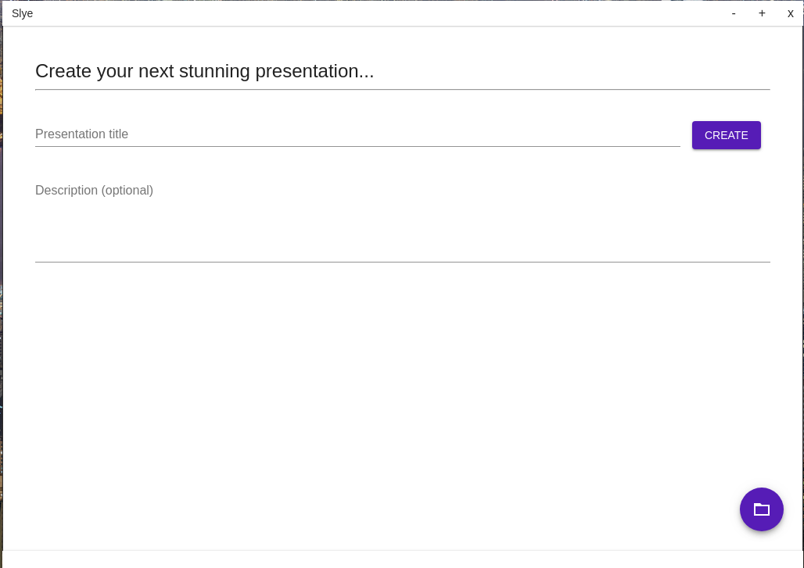
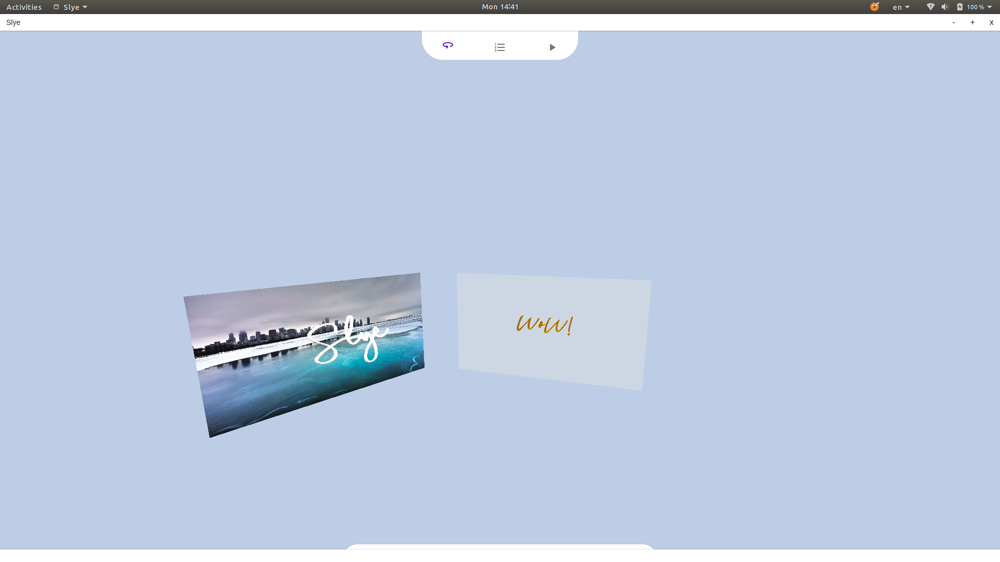
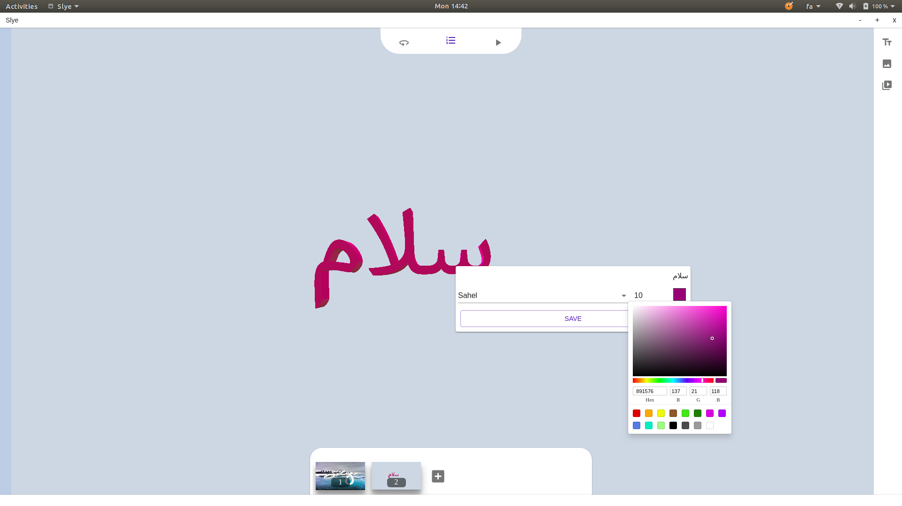
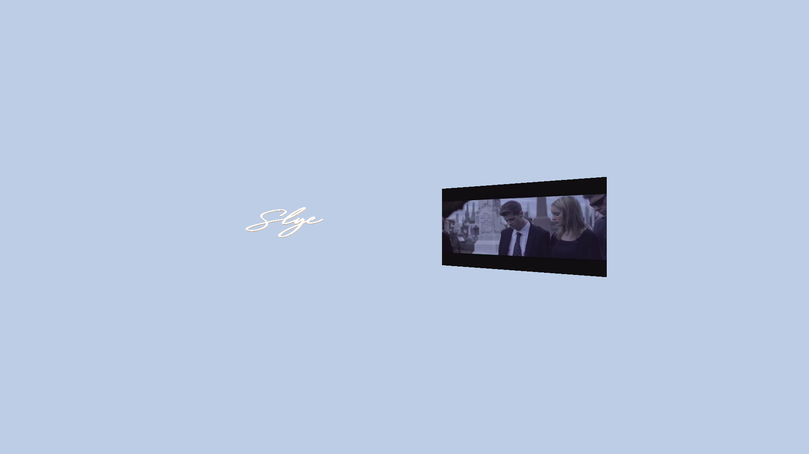
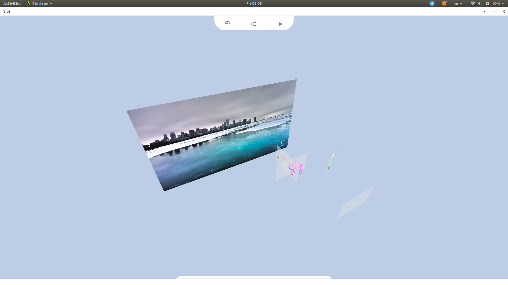

# Slye

Slye is a desktop application which helps users to create 3D presentations.

|                               |                               |                               |
| ----------------------------- | ----------------------------- | ----------------------------- |
|  |  |  |
|  |  |  |

# Demo

There is a [web demo](https://qti3e.github.io/Slye/app.html) available if you
want to try it first.
(Not all of the functionalities are implemented in the demo.)

## Directory structure

There are 3 main units in this project, `core`, `frontend` and `electron`.

Although we are using electron, we are not using node integration in our
frontend for security purposes and also we hope that one day we might be
able to use the exact code to target for web browser.

### `core`

This directory contains all the abstractions and the internal API to deal with a
Slye presentation and modules.

### `frontend`

User interface built using `React`, we are using Electron's IPC to communicate
between frontend and the electron land (A.K.A server) at the moment.

## `electron`

Codes for the main process.

## Producing a release version

First build the app:

```
npx gulp
# To build for linux
npx gulp release:linux64
# To build for windows
npx gulp release:win32
```

## Gulp tasks

| Task              | Description                                                   |
| ----------------- | ------------------------------------------------------------- |
| clean             | Remove the dist directory.                                    |
| modules:slye      | Build the default module.                                     |
| modules           | Runs `modules:slye`.                                          |
| electron:main     | Bundle electron's main process bundle.                        |
| electron:preload  | Bundle electron's preload script.                             |
| electron:renderer | Bundle UI.                                                    |
| electron:icons    | Copy icons to the `dist` directory.                           |
| electron          | Runs `electron:*`                                             |
| package:win32     | Creates a binary release for Win32 using Electron packager.   |
| package:win32     | Creates a binary release for Linux64 using Electron packager. |
| web               | Build the website and the web demo.                           |
| build:electron    | Runs `clean`, `modules`, `electron`                           |
| build:web         | Runs `clean`, `modules`, `web`                                |
| binary:all        | Runs `build:electron` followed by `package:*`                 |
| deploy            | Build and deploy the website                                  |
| serve             | Start a HTTP server on port 8080.                             |
| test:bundle       | Bundle the test files.                                        |
| test:run          | Starts the tests. (server should be running)                  |
| test              | Start server, build tests and run tests.                      |

## TODO

- [ ] Documents
- [ ] End-user manuals
- [ ] Tests
- [ ] Templates

## Contributions

Once you've cloned the repository locally you can start hacking.

```
git clone https://github.com/qti3e/Slye.git
cd Slye
# Install dependncies.
yarn
# Build preload and main process.
npx gulp
# Start the dev server. (Make sure port 1234 is free.)
yarn dev
```

Sometimes `parcel` does not terminates and you have to kill it yourself:

```
kill $(ps aux | grep '[p]arcel' | awk '{print $2}')
```
